# 🌱 Awesome Precision Agriculture 🚜

<p align="center">
  
</p>

<p align="center">
  <a href="https://github.com/ishandutta2007/Awesome-Awesome-Awesome"></a><a href="https://discord.gg/jc4xtF58Ve"></a> <a href="https://github.com/ishandutta2007/Awesome-Precision-Agriculture/stargazers"></a> <a href="https://github.com/ishandutta2007/Awesome-Precision-Agriculture/network/members"></a> <a href="https://github.com/ishandutta2007/Awesome-Precision-Agriculture/blob/main/LICENSE"></a> <a href="https://github.com/ishandutta2007"></a>
</p>

---

A curated, comprehensive catalog of **Software-as-a-Service (SaaS)** platforms, **Farm Management Information Systems (FMIS)**, **GPS guidance & tractor autosteer**, **satellite remote sensing (NDVI)**, **agricultural computer vision & AI**, and **open-source developer tools** powering modern precision farming and digital agronomy.

Whether you are a farmer, agronomist, agricultural enterprise engineer, agtech researcher, drone pilot, or software developer, this guide provides complete transparency into commercial platform pricing, free-tier limits, and the open-source software stack.

---

## 📑 Table of Contents

- [📊 Sector Overview & Market Intelligence](#-sector-overview--market-intelligence)
- [🏢 SaaS & Hosted Commercial Platforms](#-saas--hosted-commercial-platforms)
- [⭐ Open-Source Precision Agriculture Projects (Ranked by Stars)](#-open-source-precision-agriculture-projects-ranked-by-stars)
- [🧱 Architectural Blueprint for Self-Hosted AgTech Systems](#-architectural-blueprint-for-self-hosted-agtech-systems)
- [📈 Star History](#-star-history)
- [🤝 How to Contribute](#-how-to-contribute)
- [⚖️ Disclaimer & License](#️-disclaimer--license)

---

## 📊 Sector Overview & Market Intelligence

> 💡 **Market Size & Industry Structure:** The global **Precision Agriculture Market** was valued at approximately **$9.5 Billion – $10.5 Billion** in 2023–2024 and is projected to reach **$21.0 Billion – $24.0 Billion by 2030**, compounding at a CAGR of **~12.5%**. 
>
> The industry is **moderately to highly fragmented** rather than a winner-take-all monopoly. Competition spans four distinct categories:
> 1. **Machinery OEMs** (*John Deere, Trimble, Topcon, TeeJet*) who control in-cab consoles and ISO-BUS machine telemetry.
> 2. **Global Agriscience Conglomerates** (*Bayer Climate FieldView, BASF xarvio, Corteva Granular, Syngenta Cropwise*) offering input prescriptions and crop protection intelligence.
> 3. **Specialized AI, Drone & IoT AgTech Startups** (*Taranis, CropX, Arable, xFarm, Sentera, Agremo*) delivering high-resolution sensors and computer vision.
> 4. **A Robust Open-Source Stack** (*farmOS, AgOpenGPS, OpenDroneMap, QGIS, GDAL*) providing self-hostable alternatives and developer foundations.

---

## 🏢 SaaS & Hosted Commercial Platforms

The table below catalogs major precision farming SaaS platforms, sorted descending by company size, market capitalization, or valuation. Every entry features exact starting prices and transparent free-tier/trial limitations.

| Platform | Description & Core Capabilities | Company Size / Valuation / Revenue | Starting Pricing | Free Tier / Trial Limits |
| :--- | :--- | :--- | :--- | :--- |
| **🚜 [John Deere Operations Center](https://operationscenter.deere.com/)** | Connected farm management platform for managing equipment, fields, operators, work plans, and machine telemetry with planning, job quality monitoring, and yield analysis. | **~$115B Market Cap** / $55B+ Annual Revenue (Deere & Company, NYSE: DE) | **$195/machine/year** (Operations Center PRO Service diagnostic & maintenance license) | **Free Forever:** Core platform is 100% free with no acreage caps, including field setup, JDLink machine connectivity, wireless data transfer, and agronomic mapping. |
| **🌱 [xarvio FIELD MANAGER](https://www.xarvio.com/)** | BASF digital farming platform supporting crop management, field monitoring, disease intelligence, variable-rate application (VRA) recommendations, and scouting. | **~$45B Market Cap** / $70B+ Total Rev ($10B+ Ag Division, BASF SE, XETRA: BAS) | **€3/hectare/year** (FIELD MANAGER core subscription) | **Free Forever:** xarvio Scouting app is free forever with unlimited camera scans for disease, weed, and pest identification; **30-day free trial** of FIELD MANAGER. |
| **📊 [Granular Insights](https://www.granular.ag/)** | Corteva farm management and agricultural analytics platform supporting operational workflows, financial management, production analysis, and agronomic planning. | **~$40B Market Cap** / $17B+ Annual Revenue (Corteva, Inc., NYSE: CTVA) | **$499/year** (Granular Business / Advanced Financials starting tier) | **Free Forever:** Granular Insights tier is free forever (directed scouting, field boundaries, and basic satellite imagery across entire farm acreage); **30-day free trial** for Business modules. |
| **🌾 [Cropwise](https://www.cropwise.com/)** | Syngenta digital agriculture ecosystem offering farm management, satellite crop monitoring, precision farming, data analytics, and agronomic decision-support. | **~$32B Enterprise Valuation** / $32B+ Annual Revenue (Syngenta Group / ChemChina) | **$1.50/acre/year** (Cropwise Imagery & Operations subscription) | **Free Forever:** Cropwise Grower app is free forever for weather alerts, basic scouting, and crop advisory; **30-day free trial** of Cropwise Imagery and variable-rate mapping. |
| **🛰️ [Climate FieldView](https://climate.com/)** | Bayer digital agriculture platform for collecting, visualizing, and analyzing field and agronomic data from planting to harvest. | **~$30B Market Cap** / $24B+ Ag Division Rev (Bayer AG / Crop Science, XETRA: BAYN) | **$499/year** (FieldView Plus tier) | **Free Forever:** FieldView Basic plan offers free account access for data storage, field upload, and basic mapping; **1-year free trial** of FieldView Plus for qualifying operations (or 30-day trial in select regions). |
| **🚁 [DJI Agriculture](https://ag.dji.com/)** | Agricultural drone ecosystem (DJI SmartFarm & DJI Terra) supporting autonomous crop spraying, field mapping, multispectral imaging, and variable spraying. | **~$18B Private Valuation** / $4.5B+ Annual Revenue (DJI / Da-Jiang Innovations) | **€1,860/year** (DJI Terra Agriculture license; DJI SmartFarm Web is $0) | **Free Forever:** DJI SmartFarm Web & App is free forever for personal spray drone flight logging, telemetry, and team sharing; **1-month free trial** of DJI Terra (6-month trial bundled with Agras drone). |
| **🗺️ [Trimble Ag Software](https://agriculture.trimble.com/software)** | Precision agriculture ecosystem supporting field records, machine connectivity, GPS guidance, farm planning, input management, and operational analytics. | **~$15B Market Cap** / $3.8B+ Annual Revenue (Trimble Inc., NASDAQ: TRMB) | **$199/year** (Farmer Core tier; optional AutoSync display connection at $99/display/year) | **30-day free trial** via authorized Trimble dealer network with full access to field mapping, record-keeping, and display connectivity. |
| **💧 [Prospera / Valley Insights](https://prospera.ag/)** | Valmont digital agriculture and AI crop intelligence focused on pivot-mounted computer vision crop monitoring, irrigation optimization, and anomaly detection. | **~$4.8B Market Cap** / $4.2B+ Annual Revenue (Valmont Industries, NYSE: VMI) | **$12/acre/year** (Valley Insights AI crop and pivot monitoring subscription) | **30-day / 1-season pilot trial** on 1 center-pivot irrigation system (covering approximately 120–160 acres). |
| **🚜 [Topcon Agriculture Platform (TAP)](https://www.topconpositioning.com/agriculture)** | Cloud-based precision agriculture ecosystem providing guidance, autosteer, machine control, variable-rate application, field mapping, and connected farm telemetry. | **~$2.0B Market Cap** / $1.5B+ Annual Revenue (Topcon Corporation, TYO: 7732) | **$250/year per connected machine** (TAP Core tier) | **Free Forever:** TAP Basic account is free forever for manual field file uploads, job file conversion, and fleet telemetry visualization; **30-day free trial** of TAP Pro. |
| **🚿 [TeeJet Technologies](https://www.teejet.com/)** | Precision application controls, spray nozzle calculators, guidance consoles, and variable-rate farming hardware/software systems. | **~$1.2B Private Valuation** / $800M+ Revenue (Spraying Systems Co. / TeeJet) | **$1,450** (Matrix 430 GNSS console hardware & preloaded software package; $0 recurring SaaS fee) | **Free Forever:** SpraySelect and TeeJet Mobile nozzle selection/calibration apps are free forever ($0); field computer firmware updates provided free for the life of hardware. |
| **🔍 [Taranis](https://taranis.com/)** | AI-powered crop intelligence platform using sub-millimeter aerial imagery, computer vision, and agronomic models to identify weed species, insect damage, and nutrient deficiency. | **~$300M Private Valuation** ($100M+ Venture Raised / Series C/D) | **$15/acre/year** (AI leaf-level scouting subscription; typically 250–500 acre minimum contract) | **1-flight field evaluation trial** (pilot covering up to 50–100 acres with full leaf-level weed, disease, and nutrient deficiency detection reports). |
| **📡 [Ag Leader (AgFiniti)](https://www.agleader.com/agfiniti/)** | Cloud-based farm connectivity platform offering GPS guidance mapping, machine telemetry, prescription generation, and remote display control. | **~$200M Private Valuation** / $75M+ Annual Revenue | **$350/year** (AgFiniti Essentials annual license) | **Free Forever:** Free account includes up to 5 GB cloud storage, wireless file transfer, display sharing, and mobile map viewing; **30-day free trial** of AgFiniti Essentials (activated once per account). |
| **🌱 [CropX](https://cropx.com/)** | Digital agronomy platform integrating real-time soil sensors, telemetry, satellite data, and weather intelligence for precision irrigation and nutrient management. | **~$180M Private Valuation** ($60M+ Venture Raised) | **$300/sensor/year** (Platform subscription; paired with $695 one-time sensor hardware) | **14-day free trial** on web and mobile platform with simulated virtual sensor datasets and irrigation modeling tools. |
| **🛰️ [Hummingbird Technologies](https://agreena.com/)** | Remote sensing and imagery analytics platform utilizing satellite and UAV data for crop canopy monitoring, yield prediction, and sustainability verification. | **~$150M Private Valuation** ($80M+ Venture Raised by parent Agreena) | **€3.50/hectare/year** (Canopy analytics & yield prediction subscription) | **14-day free trial pilot** for up to 1 field (50 hectares) covering multispectral plant health mapping and weed detection analysis. |
| **🌡️ [Arable](https://www.arable.com/)** | In-field microclimate and crop health intelligence platform combining multi-spectral radiometer sensors, weather station hardware, and predictive analytics. | **~$130M Private Valuation** ($60M+ Venture Raised) | **$699/device/year** (Software subscription; paired with $1,595 Arable Mark sensor hardware) | **30-day software sandbox trial** with complete access to real-time microclimate analytics, evapotranspiration models, and plant stress indices. |
| **📱 [xFarm Technologies](https://xfarm.ag/)** | Comprehensive digital farm management platform supporting field logs, machinery tracking, environmental sensors, disease modeling, and supply chain tracing. | **~$110M Private Valuation** (€36M Series B Raised) | **€195/year** (xFarm Plus tier; €395/year for Pro) | **Free Forever:** "Start" package is free forever with no field size or acreage limits, including 15 core features (field registry, machinery tracking, task logging, weather alerts). |
| **🛰️ [Farmers Edge (FarmCommand)](https://www.farmersedge.ca/)** | High-frequency daily satellite imagery, telematics hardware, on-farm weather stations, and predictive agronomic models. | **~$100M Enterprise Valuation** / $30M+ Rev (Fairfax Financial) | **$75/month** or **$900/year** (FarmCommand Essential tier) | **30-day free trial** providing digital field boundary mapping, weather station feed integration, and satellite health imagery for up to 5 fields. |
| **🌍 [EOSDA Crop Monitoring](https://eos.com/crop-monitoring/)** | Satellite-based crop analytics platform providing vegetation indices (NDVI, NDRE, MSAVI), historical field zoning, weather analytics, and scouting management. | **~$100M Private Valuation** / $18M+ Annual Revenue (Noosphere Ventures) | **$25/month** (Essential plan) or **$2.50/ha/year** | **Free Forever:** 1 field up to 300 hectares (basic NDVI monitoring, historical data, 14-day weather forecast); **14-day free trial** of Professional plan tools. |
| **🚁 [Sentera (FieldAgent)](https://sentera.com/)** | Aerial drone imagery platform offering high-precision multispectral sensor processing, stand counts, weed maps, and seamless machinery cloud integrations. | **~$90M Private Valuation** ($35M+ Venture Raised) | **$49/month** or **$500/year** (FieldAgent Starter/Advisor analytics tier) | **Free Forever:** FieldAgent Mobile app is free forever for autonomous drone flight planning and mission execution; **30-day trial/pilot** available for advanced imagery analytics. |
| **🌾 [eAgronom](https://eagronom.com/)** | Farm management and carbon program platform supporting field planning, crop rotation, workforce tasks, sustainability compliance, and carbon credit audits. | **~$50M Private Valuation** (€15M+ Venture Raised) | **€250/year** (Base farm management tier, ~€1.50–€2.50/hectare/year) | **14-day free trial** with full access to field planning, crop rotation tracking, task management, and mobile scouting. |
| **📱 [OneSoil](https://onesoil.ai/)** | Freemium satellite crop monitoring platform with automatic field boundary detection, NDVI vegetation indices, and variable-rate seeding and fertilization prescriptions. | **~$40M Private Valuation** ($10M+ Venture Raised) | **$2/hectare/year** (OneSoil Pro tier) | **Free Forever:** Unlimited field boundaries, Sentinel-2 NDVI updates every 3–5 days, 5-year crop rotation history, and scouting notes; **14-day free trial** of OneSoil Pro. |
| **🦅 [senseFly / AgEagle (Measure Studio)](https://ageagle.com/)** | Professional fixed-wing agricultural drones (eBee) and cloud photogrammetry software for high-resolution multispectral surveying and radiometric mapping. | **~$30M Market Cap** / $15M+ Annual Revenue (AgEagle Aerial Systems, NYSE: UAVS) | **$100/month** or **$1,200/year** (Measure Studio photogrammetry & ag analytics license) | **Free Forever:** eMotion flight planning software is free with drone hardware; **14-day free trial** of Measure Studio cloud image processing and multispectral index generation. |
| **📋 [FarmQA](https://farmqa.com/)** | Agronomy scouting and farm consulting platform for recording digital crop observations, soil sampling grids, chemical recommendations, and GIS prescriptions. | **~$25M Private Valuation** / $5M+ Annual Revenue | **$800/user/year** (Agronomist / Controller platform license) | **14-day free trial** with full access to digital scouting, custom forms, recommendation tools, and 160 acres of high-resolution Planet satellite imagery. |
| **🤖 [Agremo](https://www.agremo.com/)** | AI-driven drone imagery analytics platform providing automated plant counting, stand establishment, weed infestation mapping, and crop stress detection. | **~$20M Private Valuation** / $3M+ Annual Revenue | **$1,950/year** (Professional tier, or ~$2/acre on-demand analysis credits) | **Free Forever:** Starter Plan includes up to 2 field drone image analyses per month and up to 100 hectares (250 acres) total uploaded map area. |

---

## ⭐ Open-Source Precision Agriculture Projects (Ranked by Stars)

The following repositories represent the world's most influential open-source precision agriculture, agricultural GIS, satellite remote sensing, IoT telemetry, crop growth simulation, machine learning, and farm data engineering projects. 

**Each repo is badged with its live GitHub star count and sorted in descending order:**

1. **[TensorFlow](https://github.com/tensorflow/tensorflow)** [](https://github.com/tensorflow/tensorflow/stargazers) — Leading open-source machine learning and deep learning framework widely used for crop disease recognition, aerial drone image classification, agricultural computer vision, and predictive yield analytics.
2. **[PyTorch](https://github.com/pytorch/pytorch)** [](https://github.com/pytorch/pytorch/stargazers) — Dominant open-source deep learning framework powering modern agricultural computer vision, weed and crop disease segmentation, drone imagery analysis, and satellite remote sensing models.
3. **[OpenCV](https://github.com/opencv/opencv)** [](https://github.com/opencv/opencv/stargazers) — Foundational open-source computer vision and image-processing library utilized across precision farming for real-time weed detection, fruit counting, crop row detection, and camera-guided robotic weeding.
4. **[Grafana](https://github.com/grafana/grafana)** [](https://github.com/grafana/grafana/stargazers) — Industry-standard open-source observability and data visualization platform for real-time precision farming dashboards, soil moisture sensor metrics, weather station telemetry, and machinery monitoring.
5. **[Apache Superset](https://github.com/apache/superset)** [](https://github.com/apache/superset/stargazers) — Modern open-source enterprise business intelligence platform suited for farm operational analytics, crop performance dashboards, yield variance tracking, and input efficiency KPIs.
6. **[scikit-learn](https://github.com/scikit-learn/scikit-learn)** [](https://github.com/scikit-learn/scikit-learn/stargazers) — Core Python machine-learning library for agricultural data science, yield prediction regression models, crop type clustering, disease risk assessment, and soil nutrient analysis.
7. **[Segment Anything (SAM)](https://github.com/facebookresearch/segment-anything)** [](https://github.com/facebookresearch/segment-anything/stargazers) — Meta's foundation model for image segmentation, enabling zero-shot field boundary delineation, individual plant/crop segmentation, weed masking, and high-resolution canopy annotation.
8. **[Pandas](https://github.com/pandas-dev/pandas)** [](https://github.com/pandas-dev/pandas/stargazers) — Essential Python data manipulation and analysis library for processing farm logs, sensor telemetry time-series, harvest yield records, and agronomic field trial experiments.
9. **[Leaflet](https://github.com/Leaflet/Leaflet)** [](https://github.com/Leaflet/Leaflet/stargazers) — Mobile-friendly open-source JavaScript library for interactive web maps, ideal for farm field boundaries, sensor overlays, and lightweight agricultural GIS applications.
10. **[Apache Spark](https://github.com/apache/spark)** [](https://github.com/apache/spark/stargazers) — Unified analytics engine for large-scale distributed data processing, capable of handling petabyte-scale satellite imagery grids, farm telemetry streams, and continental crop models.
11. **[Metabase](https://github.com/metabase/metabase)** [](https://github.com/metabase/metabase/stargazers) — User-friendly open-source business intelligence and self-service analytics tool for agronomy queries, harvest records, and farm operational dashboards.
12. **[Apache Airflow](https://github.com/apache/airflow)** [](https://github.com/apache/airflow/stargazers) — Programmatic workflow orchestration platform for scheduling automated satellite tile ingestion, weather API harvesting, NDVI pipeline generation, and ETL batch jobs.
13. **[Ultralytics YOLO (YOLOv8 / YOLO11)](https://github.com/ultralytics/ultralytics)** [](https://github.com/ultralytics/ultralytics/stargazers) — State-of-the-art real-time object detection and instance segmentation framework widely used for automated weed spraying robots, fruit detection, livestock counting, and drone survey imagery.
14. **[Polars](https://github.com/pola-rs/polars)** [](https://github.com/pola-rs/polars/stargazers) — Lightning-fast multi-threaded DataFrame library written in Rust, optimized for processing massive agronomic sensor datasets, soil moisture telemetry, and satellite raster pixel arrays.
15. **[Detectron2](https://github.com/facebookresearch/detectron2)** [](https://github.com/facebookresearch/detectron2/stargazers) — Meta's modular object detection and semantic segmentation platform applied to plant disease identification, crop canopy segmentation, and agricultural robotics.
16. **[InfluxDB](https://github.com/influxdata/influxdb)** [](https://github.com/influxdata/influxdb/stargazers) — Purpose-built open-source time-series database optimized for high-throughput sensor telemetry from soil moisture probes, weather stations, irrigation flow meters, and tractor CAN-bus telemetry.
17. **[XGBoost](https://github.com/dmlc/xgboost)** [](https://github.com/dmlc/xgboost/stargazers) — Optimized distributed gradient boosting library widely used in precision agriculture competitions for crop yield prediction, soil carbon estimation, and weather risk forecasting.
18. **[DuckDB](https://github.com/duckdb/duckdb)** [](https://github.com/duckdb/duckdb/stargazers) — High-performance in-process SQL OLAP database ideal for fast, zero-dependency analytics on field geospatial files (Parquet, GeoParquet, CSV) and farm management logs.
19. **[Node-RED](https://github.com/node-red/node-red)** [](https://github.com/node-red/node-red/stargazers) — Low-code flow-based development environment for integrating hardware sensors, weather APIs, MQTT brokers, LoRaWAN gateways, and automated irrigation actuators.
20. **[Label Studio](https://github.com/HumanSignal/label-studio)** [](https://github.com/HumanSignal/label-studio/stargazers) — Multi-modal data annotation tool for labeling agricultural drone imagery, bounding boxes for weeds, audio sensors, and multi-spectral datasets.
21. **[ThingsBoard](https://github.com/thingsboard/thingsboard)** [](https://github.com/thingsboard/thingsboard/stargazers) — Open-source IoT platform for device management, data collection, rule engines, and interactive dashboards for smart farming and soil moisture monitoring.
22. **[Prefect](https://github.com/PrefectHQ/prefect)** [](https://github.com/PrefectHQ/prefect/stargazers) — Modern Python workflow orchestrator for automating resilient data engineering pipelines in remote sensing, satellite processing, and agronomic modeling.
23. **[Airbyte](https://github.com/airbytehq/airbyte)** [](https://github.com/airbytehq/airbyte/stargazers) — Open-source ELT data integration engine with hundreds of connectors to centralize farm management systems, weather APIs, ERP data, and sensor databases into modern data warehouses.
24. **[LightGBM](https://github.com/microsoft/LightGBM)** [](https://github.com/microsoft/LightGBM/stargazers) — High-performance gradient boosting framework engineered by Microsoft, used for tabular farm telemetry modeling, crop growth phase prediction, and fertilizer optimization.
25. **[CesiumJS](https://github.com/CesiumGS/cesium)** [](https://github.com/CesiumGS/cesium/stargazers) — Open-source 3D geospatial visualization platform for rendering high-precision digital elevation models (DEM), 3D drone photogrammetry meshes, and topographic field contours.
26. **[CVAT (Computer Vision Annotation Tool)](https://github.com/cvat-ai/cvat)** [](https://github.com/cvat-ai/cvat/stargazers) — Powerful web-based annotation suite for precision agriculture datasets, supporting polygonal weed annotation, crop tracking, and drone video labeling.
27. **[Dagster](https://github.com/dagster-io/dagster)** [](https://github.com/dagster-io/dagster/stargazers) — Cloud-native data orchestrator designed for developing, testing, and monitoring data assets, satellite ingestion pipelines, and ML-driven precision agriculture workflows.
28. **[Dask](https://github.com/dask/dask)** [](https://github.com/dask/dask/stargazers) — Flexible Python library for parallel and distributed computing, scaling NumPy, pandas, and scikit-learn across multi-core systems and clusters for large agricultural raster datasets.
29. **[Google OR-Tools](https://github.com/google/or-tools)** [](https://github.com/google/or-tools/stargazers) — Fast, open-source operations research suite for solving complex agricultural vehicle routing problems (VRP), harvesting fleet dispatch, spray path optimization, and crop rotation planning.
30. **[Great Expectations](https://github.com/great-expectations/great_expectations)** [](https://github.com/great-expectations/great_expectations/stargazers) — Open-source data quality and validation framework ensuring the integrity of incoming farm telemetry, weather streams, field boundaries, and machinery logs.
31. **[DataHub](https://github.com/datahub-project/datahub)** [](https://github.com/datahub-project/datahub/stargazers) — Extensible metadata platform for managing data discovery, lineage, and governance across precision farming enterprise data warehouses and satellite catalog pipelines.
32. **[QGIS](https://github.com/qgis/QGIS)** [](https://github.com/qgis/QGIS/stargazers) — The world's leading open-source desktop Geographic Information System (GIS), indispensable for precision agriculture field mapping, soil zone creation, prescription map generation, and remote sensing analysis.
33. **[dbt Core](https://github.com/dbt-labs/dbt-core)** [](https://github.com/dbt-labs/dbt-core/stargazers) — Data build tool enabling data analysts and agronomy engineers to transform, test, and document SQL models within the modern data warehouse.
34. **[Eclipse Mosquitto](https://github.com/eclipse/mosquitto)** [](https://github.com/eclipse/mosquitto/stargazers) — Lightweight open-source MQTT message broker ideal for connecting edge farm IoT sensors, LoRaWAN gateways, and telemetry units in low-bandwidth rural environments.
35. **[COLMAP](https://github.com/colmap/colmap)** [](https://github.com/colmap/colmap/stargazers) — General-purpose Structure-from-Motion (SfM) and Multi-View Stereo (MVS) pipeline for high-density 3D agricultural terrain reconstruction from drone imagery.
36. **[OpenDroneMap (ODM)](https://github.com/OpenDroneMap/ODM)** [](https://github.com/OpenDroneMap/ODM/stargazers) — Premier open-source drone photogrammetry engine for processing aerial drone images into orthophotos, digital elevation models (DEM), point clouds, and multispectral agricultural index maps.
37. **[OpenMetadata](https://github.com/open-metadata/OpenMetadata)** [](https://github.com/open-metadata/OpenMetadata/stargazers) — Unified metadata management and governance platform for cataloging spatial data assets, sensor tables, and agronomic analytics pipelines.
38. **[Apache NiFi](https://github.com/apache/nifi)** [](https://github.com/apache/nifi/stargazers) — Enterprise dataflow automation engine designed to ingest, route, transform, and deliver real-time agricultural telemetry from combine harvesters, weather stations, and IoT networks.
39. **[GDAL](https://github.com/OSGeo/gdal)** [](https://github.com/OSGeo/gdal/stargazers) — The fundamental open-source translator library for raster and vector geospatial data formats, underpinning virtually all agricultural GIS and remote-sensing software.
40. **[WebODM](https://github.com/OpenDroneMap/WebODM)** [](https://github.com/OpenDroneMap/WebODM/stargazers) — User-friendly web interface and workflow engine for OpenDroneMap, enabling self-hosted aerial drone mapping, crop vegetation index viewing, and 3D elevation analysis.
41. **[Xarray](https://github.com/pydata/xarray)** [](https://github.com/pydata/xarray/stargazers) — N-dimensional labeled array library for Python, essential for analyzing multi-temporal climate forecasts, gridded weather models, and multi-band satellite data cubes.
42. **[Geemap](https://github.com/gee-community/geemap)** [](https://github.com/gee-community/geemap/stargazers) — Python package for interactive mapping with Google Earth Engine, streamlining agricultural remote sensing, global crop classification, and time-series NDVI extraction.
43. **[Leafmap](https://github.com/opengeos/leafmap)** [](https://github.com/opengeos/leafmap/stargazers) — Comprehensive Python library for geospatial analysis, interactive field mapping, and raster visualization with minimal code in Jupyter notebooks.
44. **[Rasterio](https://github.com/rasterio/rasterio)** [](https://github.com/rasterio/rasterio/stargazers) — Clean, idiomatic Python library built on GDAL for fast raster data I/O, multispectral band arithmetic, NDVI computation, and geospatial satellite tiling.
45. **[TorchGeo](https://github.com/microsoft/torchgeo)** [](https://github.com/microsoft/torchgeo/stargazers) — PyTorch domain library providing datasets, samplers, transforms, and pre-trained backbones for geospatial Earth observation and agricultural remote sensing.
46. **[OpenSfM](https://github.com/mapillary/OpenSfM)** [](https://github.com/mapillary/OpenSfM/stargazers) — Structure-from-Motion library built on OpenCV, designed to reconstruct camera poses and 3D point clouds from agricultural drone flights.
47. **[PostGIS](https://github.com/postgis/postgis)** [](https://github.com/postgis/postgis/stargazers) — Spatial database extender for PostgreSQL, serving as the gold standard open database for storing field polygons, soil sampling grids, variable-rate zones, and tractor GPS breadcrumbs.
48. **[GeoServer](https://github.com/geoserver/geoserver)** [](https://github.com/geoserver/geoserver/stargazers) — Java-based open-source geospatial server for sharing, processing, and editing agricultural maps via standard OGC protocols (WMS, WFS, WCS).
49. **[OpenFarm](https://github.com/openfarmcc/OpenFarm)** [](https://github.com/openfarmcc/OpenFarm/stargazers) — Free and open database and crop intelligence platform for crowd-sourced farming and gardening knowledge, companion planting, and crop environmental requirements.
50. **[OpenRouteService](https://github.com/GIScience/openrouteservice)** [](https://github.com/GIScience/openrouteservice/stargazers) — Open-source spatial routing engine based on OpenStreetMap data, adaptable for agricultural fleet logistics, rural field access routing, and machinery haulage.
51. **[AgOpenGPS](https://github.com/FarmerBrianT/AgOpenGPS)** [](https://github.com/FarmerBrianT/AgOpenGPS/stargazers) — Flagship open-source precision agriculture project providing GPS-based tractor autosteer, field guidance lines (A-B lines), section control, variable-rate application, and machine automation.
52. **[eo-learn](https://github.com/sentinel-hub/eo-learn)** [](https://github.com/sentinel-hub/eo-learn/stargazers) — Open-source framework bridging Earth observation data with machine learning in Python for automated crop classification, field segmentation, and vegetation anomaly detection.
53. **[WhiteboxTools](https://github.com/jblindsay/whitebox-tools)** [](https://github.com/jblindsay/whitebox-tools/stargazers) — Advanced geospatial and hydrological analysis engine built in Rust, specialized for digital elevation model (DEM) processing, slope/aspect calculation, and agricultural watershed delineation.
54. **[farmOS](https://github.com/farmOS/farmOS)** [](https://github.com/farmOS/farmOS/stargazers) — Complete web-based farm management, planning, and record-keeping system built on Drupal, providing an extensible database for crops, livestock, field mappings, soil tests, and IoT sensor logs.
55. **[Open Data Cube (datacube-core)](https://github.com/opendatacube/datacube-core)** [](https://github.com/opendatacube/datacube-core/stargazers) — High-performance Earth observation data architecture for organizing and analyzing continental-scale satellite imagery time-series (Sentinel, Landsat) for precision agriculture.
56. **[GRASS GIS](https://github.com/OSGeo/grass)** [](https://github.com/OSGeo/grass/stargazers) — Established open-source GIS offering rich capabilities for raster analysis, agricultural hydrological modeling, digital terrain modeling, and remote sensing.
57. **[SentinelHub-py](https://github.com/sentinel-hub/sentinelhub-py)** [](https://github.com/sentinel-hub/sentinelhub-py/stargazers) — Python client for searching, downloading, and processing Copernicus Sentinel-1, Sentinel-2, and Landsat satellite imagery for crop health monitoring.
58. **[rioxarray](https://github.com/corteva/rioxarray)** [](https://github.com/corteva/rioxarray/stargazers) — Rasterio geospatial extension for Xarray, allowing easy spatial clipping, reprojecting, and raster algebra on multi-dimensional agricultural datasets.
59. **[MicMac](https://github.com/micmacIGN/micmac)** [](https://github.com/micmacIGN/micmac/stargazers) — Powerful scientific open-source photogrammetry suite developed by the French National Institute of Geographic and Forest Information (IGN) for generating elevation models and orthophotos.
60. **[PlantCV](https://github.com/danforthcenter/plantcv)** [](https://github.com/danforthcenter/plantcv/stargazers) — Open-source image analysis software package tailored specifically for high-throughput plant phenotyping and scientific crop growth monitoring.
61. **[AgML (Agricultural Machine Learning)](https://github.com/AgML-Team/AgML)** [](https://github.com/AgML-Team/AgML/stargazers) — Open-source benchmark database and Python framework for agricultural machine learning, plant detection, and yield estimation.
62. **[PySTAC](https://github.com/stac-utils/pystac)** [](https://github.com/stac-utils/pystac/stargazers) — Python library for creating, reading, and manipulating SpatioTemporal Asset Catalog (STAC) metadata for agricultural satellite and aerial imagery collections.
63. **[STAC Browser](https://github.com/radiantearth/stac-browser)** [](https://github.com/radiantearth/stac-browser/stargazers) — Open-source visual catalog browser for exploring and querying STAC-compliant Earth observation imagery datasets.
64. **[SAGA GIS](https://github.com/saga-gis/saga-gis)** [](https://github.com/saga-gis/saga-gis/stargazers) — System for Automated Geoscientific Analyses GIS, providing specialized geostatistical algorithms for digital soil mapping, terrain analysis, and hydrological precision farming studies.
65. **[APSIM Next Generation](https://github.com/APSIMInitiative/ApsimX)** [](https://github.com/APSIMInitiative/ApsimX/stargazers) — Highly respected agricultural systems simulator modeling crop growth, soil water/nitrogen dynamics, and climate impact across complex farming enterprises.
66. **[PCSE (Python Crop Simulation Environment)](https://github.com/ajwdewit/pcse)** [](https://github.com/ajwdewit/pcse/stargazers) — Python framework implementing physiological crop growth models (WOFOST, LINTUL) for simulating crop biomass, water consumption, and grain yield.
67. **[AquaCrop-OSPy](https://github.com/aquacropos/aquacrop)** [](https://github.com/aquacropos/aquacrop/stargazers) — Open-source Python implementation of the FAO AquaCrop model, specialized in crop water productivity, deficit irrigation planning, and drought response.
68. **[AgOpenGPS Hardware & PCBs](https://github.com/FarmerBrianT/AgOpenGPS_Boards)** [](https://github.com/FarmerBrianT/AgOpenGPS_Boards/stargazers) — Open hardware schematics, PCB designs, microcontroller firmware, and steer angle sensor interfaces for building AgOpenGPS tractor autosteer controllers.
69. **[DSSAT (Decision Support System for Agrotechnology Transfer)](https://github.com/DSSAT/dssat-csm-os)** [](https://github.com/DSSAT/dssat-csm-os/stargazers) — Standard crop simulation model suite covering over 42 crops, widely used in international agricultural research, yield modeling, and climate resilience studies.
70. **[AgGateway ADAPT Framework](https://github.com/AgGateway/ADAPT)** [](https://github.com/AgGateway/ADAPT/stargazers) — Industry-standard open-source plugin framework providing unified data models and converters to bridge propriety tractor console formats (ISOBUS, shapefiles, proprietary OEM cards).
71. **[WOFOST](https://github.com/ajwdewit/wofost)** [](https://github.com/ajwdewit/wofost/stargazers) — World Food Studies mechanistic crop growth simulation model estimating daily photosynthesis, respiration, transpiration, and yield based on soil and weather drivers.
72. **[PySEBAL](https://github.com/watermodelling/PySEBAL_dev)** [](https://github.com/watermodelling/PySEBAL_dev/stargazers) — Python library implementing the Surface Energy Balance Algorithm for Land (SEBAL) to calculate actual agricultural evapotranspiration and crop water consumption from satellite data.
73. **[farmOS Map](https://github.com/farmOS/farmOS-map)** [](https://github.com/farmOS/farmOS-map/stargazers) — Agricultural mapping JavaScript component built on OpenLayers, providing vector layer drawing, field measurement, and GeoJSON integration for farmOS.
74. **[farmOS.py](https://github.com/farmOS/farmOS.py)** [](https://github.com/farmOS/farmOS.py/stargazers) — Official Python SDK for the farmOS REST API, enabling automated sensor ingestion, field record creation, and agricultural data synchronization.
75. **[farmOS.js](https://github.com/farmOS/farmOS.js)** [](https://github.com/farmOS/farmOS.js/stargazers) — Official JavaScript client library for interacting with farmOS instances from web and mobile applications.

---

## 🧱 Architectural Blueprint for Self-Hosted AgTech Systems

Modern precision farming solutions can be built entirely using open-source building blocks by combining specialized layers:

```
┌─────────────────────────────────────────────────────────────────────────┐
│                    🌾 User Interface & Operations Layer                 │
│         farmOS (FMIS) • QGIS (GIS) • Apache Superset / Grafana (Dash)   │
└────────────────────────────────────┬────────────────────────────────────┘
                                     │
┌────────────────────────────────────┴────────────────────────────────────┐
│                    🛰️ Geospatial & Remote Sensing Layer                 │
│         GDAL • PostGIS • GeoServer • OpenDroneMap / WebODM • Rasterio    │
└────────────────────────────────────┬────────────────────────────────────┘
                                     │
┌────────────────────────────────────┴────────────────────────────────────┐
│                    🤖 AI, Computer Vision & Agronomic Analytics         │
│     PyTorch • YOLOv8 • PlantCV • APSIM / WOFOST (Crop Models) • OR-Tools│
└────────────────────────────────────┬────────────────────────────────────┘
                                     │
┌────────────────────────────────────┴────────────────────────────────────┐
│                    🚜 In-Field IoT & Machinery Telemetry Layer          │
│    AgOpenGPS (Autosteer) • ThingsBoard • Node-RED • Mosquitto (MQTT)    │
└─────────────────────────────────────────────────────────────────────────┘
```

1. **🚜 Farm Management & In-Field Hardware**: Use **farmOS** as your central operational record database and **AgOpenGPS** for in-cab GPS guidance, section control, and tractor autosteer.
2. **📡 Telemetry & IoT Sensor Ingestion**: Connect soil moisture sensors, weather stations, and irrigation controllers via **Node-RED**, **Eclipse Mosquitto (MQTT)**, and **ThingsBoard**, storing time-series streams in **InfluxDB**.
3. **🛰️ Earth Observation & Aerial Imagery**: Process Copernicus Sentinel-2 satellite data using **SentinelHub-py**, **eo-learn**, and **Open Data Cube**. Transform drone mapping flights into orthophotos and DSMs using **OpenDroneMap (ODM)**.
4. **🧠 Machine Learning & Plant Science**: Implement weed detection and plant disease classification with **YOLOv8** and **PyTorch**, or simulate crop biomass and water consumption using **WOFOST**, **PCSE**, or **APSIM**.
5. **📊 Spatial Analytics & Visualization**: Store field boundaries and variable-rate polygons in **PostGIS**, query with **DuckDB**, and publish interactive maps with **Leaflet** and **Apache Superset**.

---

## 📈 Star History

[](https://star-history.dera.page/#ishandutta2007/Awesome-Precision-Agriculture&type=date&legend=top-left)

---

## 🤝 How to Contribute

Contributions, updates, and corrections are warmly welcomed!

1. 🍴 **Fork** this repository.
2. 🌿 **Create a feature branch**: `git checkout -b add-agtech-tool`
3. 📝 **Add or edit entries** in `README.md` (maintain the alphabetical/star sorting and factual formatting).
4. 🚀 **Submit a Pull Request** with a brief summary of the changes.
5. ⭐ **Star this repository** if you found it valuable!

---

## ⚖️ Disclaimer & License

- **Disclaimer:** This repository is a community-curated educational index. Precision agriculture recommendations depend heavily on local soil types, microclimates, crop varieties, and regional farming practices. Satellite and drone data should complement—not replace—certified agronomic consultation.
- **License:** Released under the [MIT License](LICENSE).
